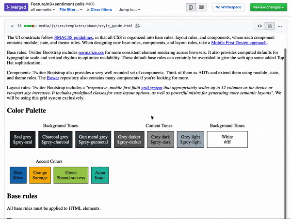

# GitHub PRoView

Some ideas for github web ui

## Install

- [Chrome Web Store](https://chrome.google.com/webstore/detail/kcghmfiabkomnbibgfahnhfdongpjobf)

- [Github Releases](https://github.com/iamogbz/gh-pro-view/releases)

## Features

### [File Preview HTML](https://github.com/twbs/bootstrap/blob/gh-pages/2.3.2/index.html)

### [File Types Filter](https://github.com/facebook/react/pull/13509/files)

## Configure

View the [options](chrome://extensions/?options=kcghmfiabkomnbibgfahnhfdongpjobf) page to add an API token used for some features.

## Contribute

See the [contribution guide](https://github.com/iamogbz/gh-pro-view/blob/master/CONTRIBUTING.md) for local development and testing!

## Extras

Heavily influenced by

- The awesome and [`refined-github`](https://github.com/sindresorhus/refined-github)
- The inspired [`github html preview`](https://github.com/htmlpreview/htmlpreview.github.com)
